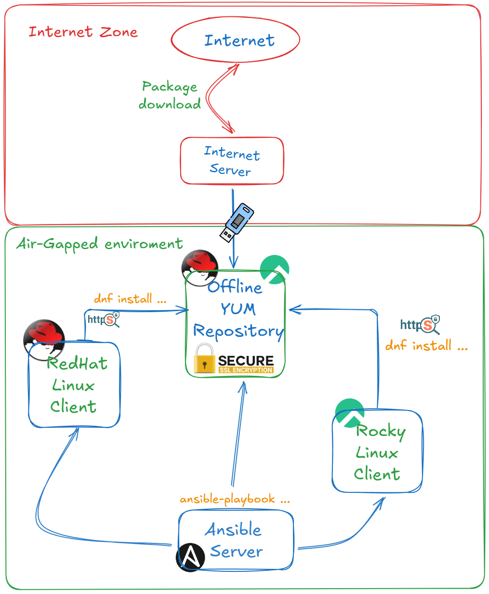

# Install Offline YUM Repository Server

Welcome to the **Install Offline YUM Repository Server** repository! This repository contains all the necessary files to assist in setting up an air-gapped YUM repository server for RedHat-based systems, including RedHat, AlmaLinux, and Rocky Linux. It is specifically designed for systems based on release 8.10, ensuring a secure and isolated environment. Detailed instructions for the setup process are available in the referenced blog. By using an offline YUM repository, you can enhance system security, minimize dependency on external networks, and maintain control over package updates in air-gapped or restricted environments.

---

## Repository Contents

- **Package download Scripts**: Scripts that download the necessary packages for creating an offline YUM repository server and scripts that download your project packages - you will need to update the script based on your project packages that need to be downloaded. Both scripts can be found under the "package-download-script" folder.
- **ansible Playbook**: Most of the process is done using ansible playbook. the files can be found under"ansible" folder

---

## Reference Blog
For a detailed explanation of how to create an air-gapped repository for RedHat-based systems, refer to the following blog post:

- Install Your Own Air-Gapped Offline Repository Based on RedHat Distribution - .([https://medium.com/@dudu.zbeda_13698/install-your-own-air-gapped-repository-based-on-redhat-distribution-ff76afe48640](https://medium.com/@dudu.zbeda_13698/how-to-set-up-an-air-gapped-yum-repository-for-redhat-based-systems-ff76afe48640)

---

## Repository Link
You can access this repository here:  
[Install Offline YUM Repository Server Repository](https://github.com/dzbeda/install-offline-yum-repo.git)

---

## Connect on LinkedIn and on Medium
Stay updated on more guides and insights related to Linux, DevOps, and system integration:
For updates please follow me on 
- LinkedIn: [www.linkedin.com/in/davidzbeda](https://www.linkedin.com/in/davidzbeda)
- Medium: [@dudu.zbeda_13698](https://medium.com/@dudu.zbeda_13698)

---

***David (Dudu) Zbeda***
